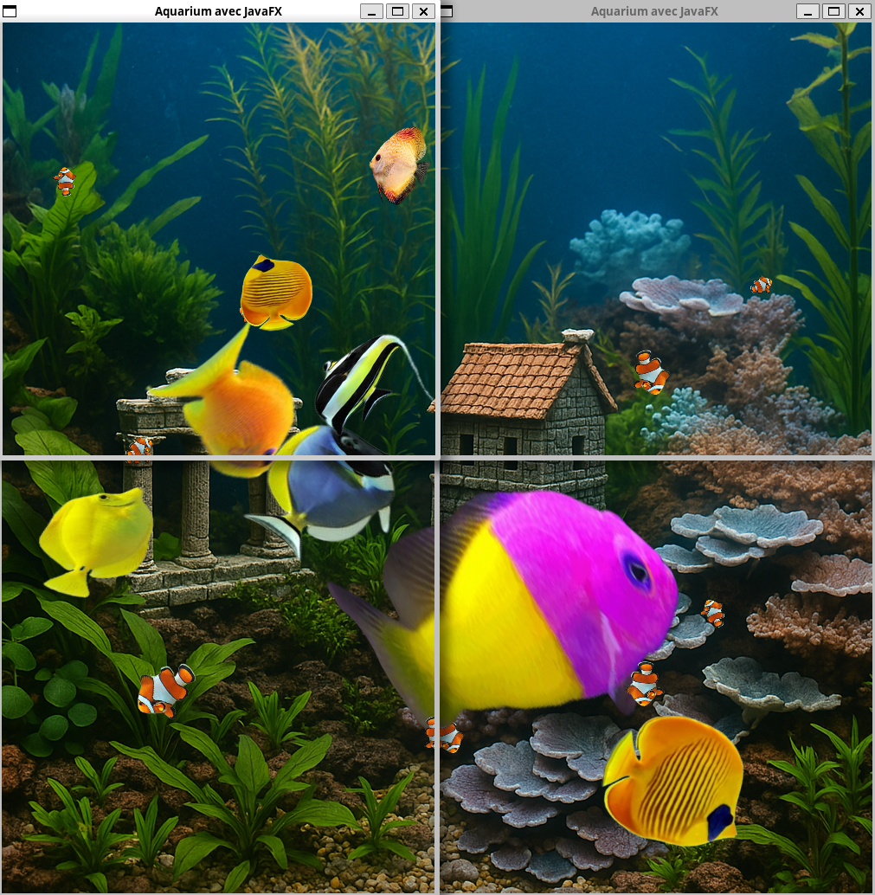

# Projet de réseaux

This networking project was created in my exchange in Bordeaux, France.

The main goal was to create a master-slave-architecture where the master (contrôleur)
was supposed to be written in C, whereas the slave was written in Java using JavaFX.

We had to stick closely to the specifications of the project.

# Installation

## Affichage

### Installation JavaFX

- Aller sur https://gluonhq.com/products/javafx/
- Sous Downloads, choisir JavaFX version 21.0.x [LTS], OS, Architecture et Type=SDK
- Download
- Unzip et copier le dossier `javafx-sdk/` dans `Affichage/`

### Installation Jline

- Aller dans Affichage/
- `mkdir lib && cd lib`
- `curl -O https://repo1.maven.org/maven2/org/jline/jline/3.29.0/jline-3.29.0.jar`
- `curl -O https://repo1.maven.org/maven2/org/jline/jline-terminal/3.29.0/jline-terminal-3.29.0.jar`
- `curl -O https://repo1.maven.org/maven2/org/jline/jline-reader/3.29.0/jline-reader-3.29.0.jar`

## Contrôleur

### Installation ncurses

 - Installer les packages libncurses5-dev libncursesw5-dev

# Lancer les programmes

## Contrôleur

- `make`
- Ensuite, charger un aquarium stocké dans `Controleur/aquariums`

## Affichage

- `make` pour afficher en plein écran
- `make small` pour afficher plusieures affichages sur un écran
